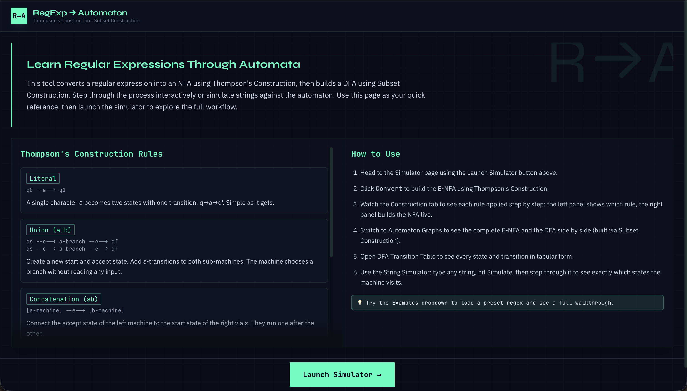

# RegExp to Automaton Visualizer

Open the deployed project:

### https://regex-to-fa-project.vercel.app/

This is an interactive Theory of Computation tool that converts a regular expression into:

- an epsilon-NFA using Thompson's Construction
- a DFA using Subset Construction

It also includes complete visual and educational support for checking correctness:

- Thompson rule reference panel (Literal, Union, Concatenation, Kleene Star, One or More)
- How-to-use guide panel for quick evaluator onboarding
- Construction stepper with token-by-token build progression
- Dual automaton visualization (epsilon-NFA and DFA)
- DFA transition table view
- String simulator with step controls and autoplay
- Suggested sample strings (accepted and rejected) generated from the DFA
- Dead-state visualization (∅) and dead-transition explanation during simulation

## Project Screenshot



## Implemented Features

- Regex parsing to postfix notation
- Thompson stepper for epsilon-NFA construction
- Subset-construction DFA generation
- DFA completion pass with explicit dead state (∅)
- Graph visualizations for epsilon-NFA and DFA
- DFA transition table view
- String simulator with step controls, autoplay, and reset
- Active-state highlighting in graph and table
- Dead/trap-state handling with visual feedback and explanatory notes

## What To Check 

1. Enter a regex such as (a|b)*abb and click Convert.
2. Open Construction and verify postfix-driven NFA building steps.
3. Open Automaton Graphs and inspect both epsilon-NFA and DFA structure.
4. Open DFA Transition Table and verify transitions are complete for every state-symbol pair.
5. Run simulation in DFA mode with accepted and rejected strings.
6. For rejected transitions, confirm movement to dead state ∅ is shown and remains stable.

## Local Run Instructions

Prerequisites:

- Node.js 18 or newer
- npm

Install and run:

```bash
npm install
npm run dev
```

Open http://localhost:3000.

Production build:

```bash
npm run build
npm run start
```

## Tech Stack

- Next.js (App Router)
- React + TypeScript
- Tailwind CSS
- Cytoscape.js (graph rendering)

## Repository Structure

- app: page layout and top-level UI composition
- components: input, stepper, simulator, graphs, and transition table
- lib: parser, Thompson construction, subset construction, simulation, and shared types

## Notes

- The epsilon-NFA is intentionally not completed over all symbols.
- The DFA is explicitly completed with dead-state transitions to satisfy formal DFA requirements.
